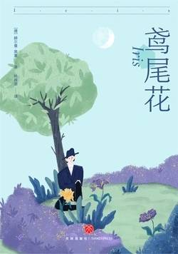

# 《鸢尾花》

作者： [德]赫尔曼·黑塞

## 【文摘】

### 笛梦

一只蜜蜂飞累了，落在了我的手臂上。我带着它一起往前走，这样我稍后第一次歇脚时，就有了给老家捎去问候的信差了。  

既然没有了回去的路，我就继续在黑暗中彻夜航行。  

### 艰难之路

噢，若我能回头就好了！但我在导游的鼎力帮助下早已爬上了岩壁和陡坡。这上面绝没有，绝没有回头路。  
  
### 鸟儿

眼睛半瞎瞄不准鸟和手指痛风举不动枪的人的身上总能找到美德和智慧。  
 
### 皮克托变形记

“好好想想！在此刻回首你的一生，找到其中的意义，否则就太晚了，而且不会再有幸福降临到你身上。”  

### 影子戏

远处是河水、芦苇和草地交织而成的明媚风光，更远处的淡青色的丛林山丘形成了轻柔的弧线，云朵追逐着它，只有燥热的风吹起的时候，人们才能看到远处稀稀拉拉的城堡与农庄的白色小光点闪烁着。  

### 鸢尾花

大地上的每一种现象都是一个比喻，而每个比喻都是一扇敞开的大门，若心灵已准备就绪，便可透过这扇门进入世界的内部，在这里，你、我、日、夜化为一体。每个人都会在生命途中的这儿或那儿踏入这扇敞开的大门，每个人总有一日会想到，所有肉眼可见的都是比喻，比喻的后面则住着灵魂和永生。但愿意进入这扇门，并用美丽表象换取预感到的内在真实的人并不多。  

一切好像都枯萎了，蒙上了灰尘，幸福再次遥不可及，而通向幸福的路看起来炎热、灰尘满满又普普通通。  

他审视着自以为细心整理过的记忆，发现了古怪又惊人的事情。他的记忆宝库比他曾以为的要小得多。当他回首时，发现这些逝去的年月空空如也，就像一页页白纸。  

这个可怜的男人痛不欲生，因为他发现自己逝去的生活已经烟消云散、化为乌有，不再属于自己，如同陌生人，毫不相干，就像曾经熟记的东西，现在却只能勉强拼凑出单调乏味的碎片。这使他越来越悲伤害怕。他一年一年地回忆，开始记录重要的经历，为了再次把它们牢牢地抓在手心。但哪些是他最重要的经历呢？是当上教授吗？是曾读博士，上大学，上中学、小学吗？是曾几何时喜欢过一阵子的某个女孩儿吗？他惊慌地仰着头：这就是生活吗？只有这些吗？他敲打额头，猛地笑了起来。  