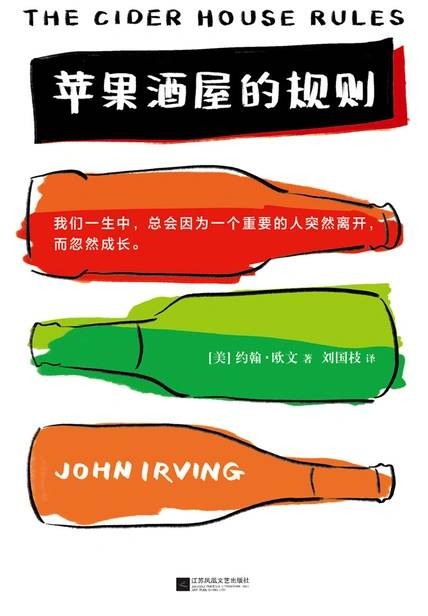

# 《苹果酒屋的规则》

作者：约翰·欧文

## 【文摘】

### 第1章 孤儿院的孩子

“明天再念，老时间，老地点。”圣拉奇总是说。尽管孩子们常常会失望地嘀嘀咕咕，可拉奇知道，他许下了一个承诺，同时也建起了一种规律。他在日志中写道：“在圣克劳兹，安全感来自于对承诺的遵守。一旦遵守了承诺，孩子们就会理解承诺的意义，并期待着下一个承诺。帮助孤儿建立安全感，过程虽然缓慢，却有规律可循。”

在圣克劳兹，我们只有一个问题，那就是荷马·威尔士：我们对待荷马的方式一向非常有效，把孤儿院变成了他的家，而这正是问题所在。假如你在一个政府机构里投入像普通家庭那样的爱心，再假如这个政府机构是一所孤儿院，而你对爱的投入又十分成功，那么就会使孤儿院变质：它本该是孤儿们寻求美好生活的歇脚处，你却将它变成了孤儿们人生旅途中的起点站同时也是终点站，使他们不愿接受其他地方。

“做人本不该冷酷无情，可是在孤儿院里，我们在爱心方面也许应该吝啬一点。如果你过于慷慨大方，孤儿们就会一个个不愿离开了，于是就会制造荷马·威尔士这样的问题——他成了一个地地道道的孤儿，圣克劳兹孤儿院成了他唯一的家。饶恕我吧，上帝！我制造了一个孤儿，他名叫荷马·威尔士，他将永远属于圣克劳兹孤儿院。”

大部分孩子都还太小，无法理解狄更斯的语言，他们甚至连圣克劳兹的日常用语都不是太懂。拉奇医生只在乎朗读本身。对那些什么都不懂的孩子来说，晚读成了他们美妙的催眠曲，而对极少数能够理解作品语言和故事情节的孩子而言，晚读则为他们提供了一个想象的空间，使他们的思绪得以离开圣克劳兹，飞向遥远的地方。

### 第2章 上帝的工作

在怀孕期间的任何阶段，如果发生子宫颈扩张，常常会导致子宫收缩，进而引发流产。

### 第3章 缅因州王子，新英格兰国王

但荷马知道这只是一个游戏，是他跟自己玩的游戏。孤儿们常常这样自得其乐。他们玩得最多的游戏，就是幻想他们的父母在四处寻找他们，希望将他们接回家去。荷马与这位神秘女婴的母亲共处过一个晚上，听说过有关她父亲的种种情况，知道他对整个事情漠不关心。荷马明白，这孩子的父母根本不会找她，也许正因为这样，他才决定要找她。如果这孩子长大后，也玩起这个古老的游戏，那么，在这个世界上至少还有一个人在找她—即使这个人同样身为孤儿，也总算聊胜于无吧！

“我真讨厌身为人父！父亲对子女的感情，会使一个人完全丧失客观性与公正心。我担心我使荷马没有了童年，我担心他根本就没有当过孩子！不过，许多孤儿宁可不要童年，因为孤儿的童年往往充满艰辛。如果我帮助荷马避开童年，是不是帮他避开了一件坏事？见鬼，当父亲的滋味真是难以言表！像父母一般疼爱某个孩子，可能会使自己受到蒙蔽，以至于无法明辨是非。”

### 第4章 年轻的威尔士医生

夜风强劲而清新，吹走了一向笼罩着圣克劳兹的湿气，天上的星星显得格外明亮，发出冷冷的光芒，而有关雪茄烟与锯木屑的记忆也随风而逝。

### 第5章 荷马食言

胎儿出世后十天内，动脉导管会变成一条细细的纤维线，造成这种变化的并非什么神秘的力量，而是胎儿的第一口呼吸，这第一口气会关闭动脉导管，打开肺部。胎儿的动脉导管具有分流作用，让血液绕过肺部流至主动脉。

八周大的胚胎虽然还没有胎动，但已经长出了鼻子嘴巴。

子宫口上覆盖着一层透明的黏液，宛如被晨雾、朝露以及日出时粉红色的云气所笼罩。

### 第6章 观海果园

美洛妮读着：“我关心我自己。越是孤独，越是没有朋友，越是无依无靠，我就越要尊重我自己。”

### 第7章 大战前夕

“我们来到世上，就是要做有用的人。与其对别人说三道四，不如自己采取行动，任何行动都比袖手旁观要好。”

### 第8章 机会出击

兔子胚胎在母体子宫内只停留三十天，母兔每胎可产下五到八只小兔。为了顺应兔子的原始天性，母兔拥有两个完整的子宫。这一阶段的分化称为“复子宫”。而荷马了如指掌的人类女性子宫的构造，则为两条输卵管通往一个子宫，此阶段称为“单子宫”。第三阶段的子宫分化介于以上两者之间：部分构造合而为一，称为“两角子宫”，许多哺乳类动物——如羊——就属于这一范畴。

### 第10章 十五年后

时过境迁之后，人们真正想见的还是那些了解自己、能与自己倾心交谈的人，而且事隔多年，即使别人曾经伤害过自己，也已经不再重要了。

黎明前的那段时间是失眠者最难熬的时刻。这时，美洛妮常常喃喃自语：“十五年！”直到她迷迷糊糊快要睡着、晨光悄悄溜进她的房间里时，她才会问道：“你还在那儿吗，阳光？”随着时光的流逝，那些曾经在你心目中至关重要的人，却在你生命中的某一时期完全缺席，这是让人最难以接受的事情。

荷马默默地问：在清晨叫醒孩子，还有什么事情比这更让人充满爱意呢？不，他转而又想，是充满爱意与歉意，是两者兼而有之，他对安琪尔的爱就是这样。

孤儿的快乐可以分为几个部分。在圣克劳兹，最美好的感觉是早晨起来饥肠辘辘，那儿的煎饼从来不缺；其次是性爱，但必须是在天气好时才可以享受（当然少不了美洛妮）；再次是到处闲逛，肆意破坏（还是少不了美洛妮，不过可以不管天气好坏）；此外便是一个人独来独往，沉思冥想，只有在雨天时才可以这样（还不能有美洛妮）。尽管荷马向往家庭生活，他的经验却十分有限，因而对于家庭灵活多变的特点无法理解。

### 第11章 违反规则

安琪拉护士说：“当然，他的确不是医生，他总是会以为自己的专业知识不够，随时都担心自己可能出错。”“所以他才会成为一位好医生，”拉奇医生说，“那些自以为无所不知的医生才最会出错！一位好医生本来就应该反省，应该知道自己肯定还有不懂的地方，也随时可能因为过失而害死病人。”

“还是那句老话，”华力对安琪尔说，“我们有办法让荷马离开圣克劳兹，却无法使圣克劳兹脱离荷马。还有，感情的事是不能勉强的。希望你的爱人照你的愿望行事，或者去做你认为是对它好的事情，这都很正常，不过这一切都得顺其自然。你不能干涉你心爱的人的自由，正如你不能干涉素不相识的人。要做到这一步并不容易，因为人们往往喜欢干涉他人，喜欢自作主张。”

## 【想法】

有过一次性体验（不幸感染了淋病，“这唯一一次并不开心的风流韵事，加上记忆中父母婚姻的不幸，使这位未来的医生深信，无论是从医学还是从哲学角度来看，禁欲都是不无道理的。”）的妇产科医生韦尔伯·拉奇在圣克劳兹孤儿院担任男孩部负责人，同时从事所谓的“上帝的工作”——负责将婴儿接到人世——他们自然而然会成为孤儿，也从事所谓的“魔鬼的工作”——必要时替人堕胎。但是对韦尔伯·拉奇而言，两者都是上帝的工作。还有教导荷马·威尔士，也一直替他规划着未来。

孤儿荷马·威尔士，几次领养失败，荷马似乎属于圣克劳兹。在荷马看来“孤儿们来到世上，就是为了要做有用的人。” “荷马十二岁时，就担当起管理孤儿院的重任了”、为男孩门朗读《远大前程》《大卫·科波菲尔》为女孩们朗读《简·爱》、跟随拉奇医生学习医学——他成为了优秀的外科医生、助产士。他认同拉奇医生“上帝的工作”，但他自己却拒绝替人堕胎。

“‘一天下午，我突然厌倦了这八年来千篇一律的生活。’​简·爱的话可真是一针见血。荷马与美洛妮也曾有过好几次这样的感受，突然对自己的整个生活厌倦至极。” 如果要问读书有什么功用的话，最直接的答案莫过于和书中的某句话产生情感共鸣，把自己模模糊糊的感觉用直白的文字表现出来。

荷马遇到了华力和坎蒂，认识了圣克劳兹孤儿院之外的朋友，有了契机离开圣克劳兹孤儿院。友情、爱情、亲情，荷马的人生有了新的篇章。

“拉奇梦想着荷马在外面闯荡一番之后，会主动回到圣克劳兹。不过，梦想归梦想，谁会作这样的选择呢？拉奇在心里问道。”读到这里就可以猜到结局了，荷马必然要回到圣克劳兹孤儿院接任拉奇医生的工作，那么契机是什么呢？是什么原因让荷马改变了自己的想法？这是阅读后面的内容可以试着去猜测的。

书中的故事发生在二战前后的美国，堕胎是非法的，然而到了现在，堕胎合法化的问题还是美国社会的重要议题，甚至政治化！

如果没有做好生养孩子的准备，那么做好避孕是非常有必要的，对于当下的人们而言，避孕手段很多也很有效果。无论是堕胎还是产后遗弃，都不是什么好事。