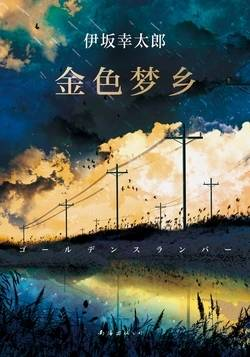

# 《金色梦乡（同名电影原著）》

作者：伊坂幸太郎
 

## 【文摘】

### 第一部 事件伊始

  “女儿。很可爱。”樋口晴子绷紧了脸，镇静地回答。她怕稍有松懈就会笑逐颜开，不停地唠叨起自己的孩子究竟有多可爱。  

### 第三部 事件发生二十年后

四平八稳的日子里，谁都能讲出几句大道理。主张人权，占领道德高地很简单。但当暴风雨来临之时，人们就慌了手脚，再无力顾及所谓的正确，只能随波逐流。人就是这样。  

带着先入为主的观念去思考分析，总容易草木皆兵，原本正常的自然现象也可能被当作敌国的阴谋。  

### 第四部 事件

 “从那时起我也开始思索，自己就这样一直下去真的好吗？”“都三十多了才考虑？”“三十多勉强还来得及。”“青柳呀，难不成你是被那个想变成巨人的怪人给感化了？”森田森吾开玩笑说，“做一个开车送货的快递员，你不满意？”“不是那个意思。我只是在怀疑那个什么准备都没有、只知道没头没脑地生活的自己而已。”  

 “瞌睡的时候开车等于亲手毁掉人的一生，是最卑鄙的事。”  

“你呀，可不能安于现状。”  

即便发生了世界范围内的大动乱，我所担心的恐怕也还是女儿的健康状况、老公的出差计划、晚饭的菜单,还有网上那些化妆品的价格吧，她在心里想。  

“回忆会在相似的情景下苏醒。既然自己能想起，对方同样也能。”  

 “是舆论操纵。你虽然是凶手，这一点值得憎恨，但你其实并不是多凶恶的人。虽然无法得到原谅，但至少可以得到同情。可以通过媒体把你塑造成那样的凶手。”“你说舆论操纵？”“形象。”佐佐木一太郎简短地说道，“形象就是这么一种东西，没什么明确的根据。人都有自身形象，社会运作也是靠形象。一家餐厅味道没怎么变却突然生意兴隆，那是因为形象变好了；原本受欢迎的演员忽然间没了工作，那是因为形象变差了。一个人刺杀了首相，却不那么惹人恨，必然也是因为有某种值得理解的形象。”  

媒体从不播出与主流意见、社会舆论或者观众兴趣相违背的信息，这才是它的本质。她并不觉得可以因此否定媒体，但至少说明，所谓的媒体、报道都不过如此而已。他们不说谎，但是会对说的内容进行取舍。  