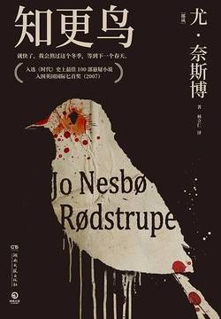

# 《知更鸟》

作者：尤·奈斯博

## 【文摘】

于是他剪下作家比约尔内博的一段话：产生动力的加速度也可以用来表达人类了解所谓自然法则的加速度。这种了解等于焦虑。

照片中是一个木质路标，上面漆有太阳十字，路标一边的箭头写着“奥斯陆两千六百一十一公里”，另一边箭头写着“列宁格勒五公里”。

她心中害怕。她并不那么害怕未知的前方，而是害怕这个她偎依着的陌生男人。如今他靠得这么近，过去她隔着一段距离观看和习惯的一切似乎全都消失了。
事都是从心底希望你好。”

以塞亚握紧拳头，又在方向盘上捶了一拳：“这不仅是审判一个人的生死，更是把对正义的信任还给大众。有时候，为了让人重获信任，死刑是必要的。”

 天气突然暖和起来，积雪开始融化。白雪闪闪发亮，是美好的一天。

 “不是警告，我只是指出一些相似的历史。历史学家的责任是揭露，不是评价。”尤尔点燃烟斗，“很多人认为对与错是固定、绝对的，但其实并非如此，对错的判断会随时间而改变。历史学家的工作主要是找出历史真相，去看数据说些什么，然后客观冷静地公开。如果历史学家介入评价人类的蠢事，从后世的眼光来看，我们的工作会变得跟化石一样，成为当时正统观念的遗骸。”

一只狗在褐色草地上游荡，鼻子在地上嗅闻，尾巴翘得老高。至少还有人欣赏奥斯陆的春天。

大雨如注，猛烈地下了一整个早上，而后太阳出人意料地闪亮登场，刹那间将天空所有乌云燃烧殆尽。

布兰豪格讲述的是友爱和共和，内容涉及忠诚的重要性和正能量的保护作用，因为民主总是容忍平庸、无责任感和领导层级的无能。当然，你不能期望民主选举选出的家庭主妇和农夫了解他们肩负的责任的复杂性。

在所有声音归于寂静之前，你最后听见的声音会是人的声音，哈利认为这让人颇感欣慰。

## 【想法】

双线写法，一边写历史（1943-1944），一边写当下（1999-2000），差不多要到内容的一般，两者才能产生交集。

书中感觉有一些不合理的地方，爱伦发现了真相，给哈利打电话打不通，电话留言只说了几句，我还以为电话留言有限制，然而到了后边，哈福森给哈利电话留言，却是一大段一大段。以书中对爱伦的描述，她判断不到形式吗？作者只是想留下悬念！

写布兰豪格被枪杀后尸检，特地强调“布兰豪格的血液中含有酒精成分，中指指甲内有阴道分泌物。”一个副外交部长，造成上班前不洗漱吗？我以为是为了后面哈利调查发现萝凯去了布兰豪格的酒店房间做铺垫，但是也没有发生，不知到特此强调为了说明什么？