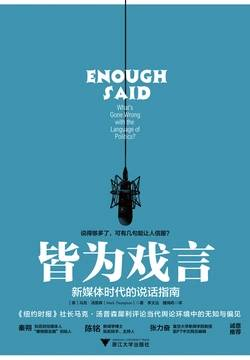

# 《皆为戏言：新媒体时代的说话指南》

作者： 马克·汤普森

## 【文摘】
### 01 无以言表

这里所说的“公共言论”是指我们在讨论政治和政策，在法庭上提出论据或在公共环境下尝试说服其他人所使用的语言。

#### 民怨载道

- 民众希望的幻灭有增无减，并对我们的政治体制形成一股不利趋势，引发了很多人的担忧。在美国和其他西方国家，政治已经变成谩骂，左派和右派之间越来越大的分歧不仅出现在政治家中间，也出现在民众中间；而主流政党愿意或能够与其对手达成和解的政策领域数量已经大幅缩减，美国更是接近于零。结果，许多全国性和由若干国家组成的政治机构的决策过程变得无比僵化。

- 党派分歧和民粹主义者已经是一个很严重的问题，但还有一个问题更加严重，那就是民众对政治漠不关心且很少参与政治事务。很多民主国家选民的投票率正呈下降趋势，年轻选民尤其如此。 
- 所谓“制度”，是指国家的宪制和政治实践、法律制度和秩序，以及我们社会一切经济活动、社会活动和文化活动赖以遵守的体系和惯例。

- 大约40年前，后来成为英国广播公司总裁的约翰·伯特（John Birt）当时还是一名电视时事制片人，以做事严谨认真而著称。他在伦敦《泰晤士报》（The Times）发表过一篇与同事彼得·杰伊（Peter Jay）合著的文章，里面有一段话是这样的：“电视新闻行业存在一种偏见，这种偏见并不针对任何一个政党或观点，而是针对民众的认知能力。”

- 约翰·伯特这篇文章的中心思想就是：电视新闻业对故事、情感和吸引眼球的事情抱有强烈兴趣，但这些最终都变成过眼云烟。也就是说，新闻媒体要么根本不播出政府制定政策时所面临的严峻选择，要么内容简短得可怜，仿佛只需让公众了解情况即可，而不必达到娱乐公众的目的。

- 我们很多人倾向于回避与自己相左的观点，并有可能变得更加固执己见，而不是灵活变通；假如类似于“死亡委员会”这样的谣言或阴谋符合我们的世界观，我们就更容易相信它。

#### 忘记了事物的本原

### 02 油腔滑调

> 花言巧语是我唯一不能容忍的东西，我只想做好分内的事情。——西尔维奥·贝卢斯科尼（Silvio Berlusconi）

### 04 公关与反公关

- 特朗普式修辞手法的基本原则在发达国家民粹主义者和反传统政治家的演说、竞选口号中却很常见。这些基本原则包括：明确反对传统政治语言中的繁文缛节及温和态度，用愤怒、惊世骇俗的语言和极度简化的政策取而代之，把“实话实说”作为公共言论的唯一标准。

#### 好日子里的坏消息

- 1987年，罗纳德·里根在柏林墙面前慷慨陈词。两年以后，也就是1989年11月9日，这堵墙被推倒了；几周后，苏联对东欧的统治宣告结束，而苏联也很快解体，冷战终结，西方成为胜利者。

- 德国开始静下心来重新整合曾属于共产主义领土的德意志民主共和国。在欧洲大陆其他国家，对苏联斗争的胜利并没有带来新的统一，而是加大了政治离心力，而它们在冷战的最后几年早就感受到了这股力量。在意大利，被称为“净手运动”（Mani Pulite）的肃贪调查加速了战后声名狼藉的贪腐政治体制的全面崩溃。然而，1994年第二共和国（the Second Republic）的成立并没有带来稳定，而是引发了左右派的进一步分裂，并让西尔维奥·贝卢斯科尼找到了上位的时机。在法国，狂热的反共社会党人弗朗索瓦·密特朗（Francois Mitterrand）当选总统，并一直执政到1995年。几年后，当他作为政治运作幕后推手和玩世不恭的作风被曝光，再加上他曾参与过法国维希政府（Vichy France）的活动，而且他的内阁曾密谋参与1994年卢旺达大屠杀，他的信誉因此而受到了影响。在执政时期，密特朗面临经济下行的风险，他只好迅速放弃法国的社会主义化进程。在随后的很多年里，密特朗在社会改革方面推行渐进主义政策，包括两度被迫与被右派控制的议会共事。密特朗的继任者是保守的温和派雅克·希拉克（Jacques Chirac），他在竞选时承诺削减政府支出和减少税收，但当上总统之后，希拉克也不得不做出妥协，几乎没有实现任何一项他承诺过的改革。下一任总统尼古拉斯·萨科齐曾是备受争议和敢于直言的内政部长，很不受左派待见。他也承诺对经济和社会进行重大改革，但这些改革最后也无疾而终，尤其是2008年全球金融危机爆发之后，萨科齐只能像他的前任一样以妥协收场。

- 英国的经济衰退从20世纪90年代就开始了。

- 1994年，托尼·布莱尔当选工党党魁。工党已经在野15年，它急于重掌政权。

- 工党这种做法就是比尔·克林顿的顾问迪克·莫里斯（Dick Morris）大约在同一时期提出的“三角策略”（triangulation）概念。

#### 小丑与秘密警察

- 早在1999年，弗拉基米尔·普京的修辞语域就已经变窄了。然而，一个国家的总统必须在各种修辞方式之间游刃自如，于是他身边的智囊，包括自称“专家治国论者”的格列布·帕夫列夫斯基开始为普京度身打造修辞方式了。他们带着浓厚兴趣研究了西方政治传播学的发展史，尤其是我们在前面几页探讨过的实践做法，普京团队把这些做法称为“直接民主制”（direct democracy）。如果俄罗斯人民可以远离国家杜马里面那种丑陋且难以控制的争吵，与他们的领导人直接进行对话，那该有多好啊！因此，直至今天，普京总统仍然经常抽出几小时参与电视直播节目，让俄罗斯民众有机会就一系列不同话题向他直接提问。

### 05 这个撒谎精怎么老对我撒谎？

- 20世纪80年代中期，英国广播公司的一名前辈告诉我，所有年轻记者迟早都要知道这个问题的答案：新闻故事就是某个地方的某个人不想你报道的东西。

### 06 狡辩

- 20世纪初，德国社会学家马克斯·韦伯（Max Webber）首次对“官僚制”（bureaucratic state）进行了系统描述。他所说的官僚制是指一种行政管理体制，在这种体制下，专业人员肩负着制定和实施公共政策的职责，每一名专家用自己的专业知识和技能制定政策，从事行政活动。

- “专家治国论者”通常用于描述韦伯模型中的专家。

- 政治家们争相在政策问题上激发民众情感，为上头条而将问题过度简单化，国家治理的复杂性、媒体疯狂挖掘政治家的缺点，这些都是现代政治的特点。然而，这些特点似乎加大了高期望与希望幻灭之间的心理落差。

- 每当谈起政治败局，我们想到的往往是失败的行动，比如政策失灵或经济无法复苏。但如今很多人的“背叛感”都来自政治家的豪言壮语与现实之间的巨大差距。

### 07 失语后如何弥补？

#### 一个关于判断的问题

- 英国哲学家托马斯·霍布斯（Thomas Hobbes）既翻译过修昔底德的《伯罗奔尼撒战争史》（History of the Peloponnesian War），也翻译过亚里士多德的《修辞学》，还见证了激烈的宗教和政治差异在17世纪前半叶导致英格兰四分五裂的场面，之后他开始相信，大部分个人的一己之见都非常易受影响，而且善变，因此他们对公共讨论或者决策制定起不到一点儿帮助作用。“大部分辩论者除了添麻烦，能用他们的无能观点给政策做出什么贡献？”霍布斯问道。

### 关于借口和语境

- 当代的“不对等”战争更是如此，具有巨大杀伤力的高科技武器被用于对付在发展中世界的平民中活动的敌人。只有在满足最高的道德标准时，那些直接和间接的人员伤亡，更不用提我方的伤亡情况，似乎才可以接受。因此就出现了专注于参战理由中最强烈的元素的巨大诱惑——国家安全和自我防卫是最大的王牌理由。崇高的理想——和平、民主、保护人权，也可以成为高价值的理由，不过在实践中可能容易受到仔细审查，查看是否存在双重标准或虚假空话的迹象。类似经济利益、地理政治、对盟国的义务或更广泛的外交考虑等其他元素则非常危险。因此，它们可能会被低调处理，或者完全省略。

## 【想法】

书名的翻译有些扯淡！！！

内容主要时政治人物的语言表达

大量使用修辞这个说法