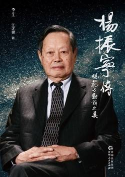

# 《杨振宁传：规范与对称之美》

 作者：江才健

## 【文摘】

### 再版序

一般都知道，杨振宁是一位诺贝尔奖得主，但是杨振宁与李政道同得诺贝尔奖的“宇称不守恒”的工作，并不是他在科学历史上最有贡献的工作，在那项工作之前杨振宁所做的“杨—米尔斯规范理论”，早已被世界公认是20世纪第二次世界大战之后最重要的理论工作，简单来说，如果和“杨—米尔斯规范理论”相比较，“宇称不守恒”在物理科学上的探索深度和在科学历史上的重要性，都相去甚远。  

### 第一章 去来中国情

黄昆考上庚款留英，1945年到英国去留学。黄昆在英国书念得很好，还跟当时英国著名的量子力学大师玻恩(M. Born)合写过一本书。1951年黄昆学成立刻回到中国，后来成为中国半导体研究方面顶尖的代表人物之一。  

1948年邓稼先比杨振宁晚三年也到美国留学。邓稼先是自费留美，经费上十分拮据，他几乎可以说是在枵腹向学的情况下，只花了11个月就念完博士学位，拿到学位之后9天就坐上了回中国的轮船。后来邓稼先成为中国造原子弹和氢弹计划中几个最重要的领导科学家之一。  

### 第二章 早熟的童年

清华建校的校园，在北京西北郊繁盛的园林区，原是清朝初年康熙皇帝之行宫“熙春园”。到了道光初年，“熙春园”一分为二，西边取名作“近春园”。到了咸丰年间，“熙春园”改名为“清华园”。清咸丰十年（1860年），英法联军入侵北京火烧圆明园，“近春园”亦遭到破坏。  

清宣统三年（1911年），清华大学在清光绪二十六年（1900年）八国联军侵华之后就荒废的这一片皇家园林上建立起来，它有着得天独厚的林园胜境，蜿蜒流过的万泉河和其间的湖泊小溪，更将其塑成“水木清华”。现在校园里荷花池畔有着朱自清塑像的“荷塘月色”，校园里闻一多和王国维的纪念碑，都述说着20世纪20年代和30年代清华大学梁启超、陈寅恪、赵元任一代大师荟萃鼎盛时期的绝代风华。  

### 第四章 纽约、普林斯顿到芝加哥

费米不仅是20世纪的伟大物理学家，还是物理科学上一个了不起的导师。他在26岁时就成为罗马大学的教授，在他的领导之下，罗马大学的物理研究所在20世纪30年代成为意大利和欧洲的一个物理研究中心，一群物理学家在他的领导下形成了所谓的“罗马学派”。  

1942年12月2日费米在芝加哥大学完成人类第一个可控制核反应器，当时在场的39个人当中就有马歇尔和瓦滕博格。  

### 第七章 分合李政道

1956年，他们两人合作写了一篇论文，对于物理学家一向深信不疑的宇称守恒定律，质疑其在弱作用中的有效性。这篇论文造成了科学概念上的一次革命，也使他们成为最早两个得到诺贝尔奖的中国人。  

### 第八章 宇称不守恒的革命

“宇称守恒”简单地说就是一种物理定律的左右对称，所以又有一种说法叫作“镜像对称”。事实上，对称在人类对宇宙的观察经验中，是早有的概念。  

19世纪发展而来的元素周期表，在量子力学发展以后，科学家才了解到周期表中的原子数，事实上可以直接从库仑定律的旋转对称中得到。同样的，反物质（反粒子）的存在，也是根据洛伦兹变换(Lorentz transformation)的对称性而在理论上预测到的。  

宇称守恒这种概念，最早是德国杰出物理学家索末菲(Arnold Sommerfeld)的学生拉波特(Otto Laporte)在1924年研究铁原子能级的时候发现并提出讨论的。1927年，大物理学家维格纳证明拉波特所讨论的概念，是左右对称所造成的结果，并且渐渐在物理中发展出宇称守恒的概念。  

1911年，英国物理学家拉瑟福德(Ernest Rutherford)在曼彻斯特大学做金箔散射实验，确定了原子中还有更小的原子核，科学家才意识到，还有比原子更小的构成物质的基本单元。  

1932年，英国物理学家查德威克(James Chadwick)发现了不带电的中子，并且确定在原子核之中只有质子和中子，电子是环绕在原子核外运动。同一年，美国加州理工学院的物理学家安德森(Carl D. Anderson)在探测来自外层空间的宇宙射线的仪器中，看到了一个新的粒子。这是人类从来没有见识过的一种东西，一种“反物质”。  

这种新的粒子是电子的反物质，叫作正电子或者正子（positron，和电子质量相同，但是带正电）。  

《在弱作用中，宇称是否守恒？》  

1957年1月初，最后查证结果显示在β衰变中宇称确实不守恒，吴健雄正式公布她的结论，也震撼了全世界的物理学界。这个发展之所以震撼如此剧烈，主要因为它影响了整个物理学界，是囊括原子、分子、核子和基本粒子物理的一个基本革命，不是一个局部性的发展。  

### 第九章 开创规范场论的大师

19世纪的物理科学发展，由现象的观察到数学结构的整合，麦克斯韦(J. C. Maxwell)的电磁方程把当时认为分开的电和磁两种现象结合起来，形成了一个可以由单一数学方式完整描述的“场”论。  

“向量玻色子”(vector boson)  

### 第十章 统计物理集大成

为了弥补力学现象以及电磁现象都是可逆而热力学不可逆的缺陷，于是有科学家引入概率的概念来解决这个问题，这便是统计力学。  

### 第十二章 每饭勿忘亲爱永

在三个孩子当中，除了杨又礼1983年在台北学过一段时间中文以外，他们基本上都不能够说中国话，对中国文化的了解也很有限。

### 第十三章 追求科学美感的独行者

  
这当然和他来自一个近代科学传统还不那么长久的环境有关，他由他的师长们身上所能够涵泳的科学风范，到底还是赶不上许多和他同一个世代的顶尖物理学家，譬如比他年长4岁的费曼和施温格，他们在成长的过程里，能够从欧洲和美国环境中得到涵养。  

>“时空对称”指物理定律在时间平移、空间平移、空间转动及洛伦兹变换下保持不变，分别对应能量、动量、角动量守恒和光速不变。爱因斯坦将时空对称性作为广义相对论的基石，而狄拉克则视其为理论形式完美的核心。

【想法】

杨振宁是理论物理学家，他因与李政道合作完成的“宇称不守恒”定律共同获得1957年的诺贝尔物理学奖。作者在再版序言中写道杨振宁的“杨—米尔斯规范理论”相对于“宇称不守恒”定律在科学史上的贡献更大。

1964年春天，杨振宁入籍美国。

书中写道杨振宁和李政道讨论的情形：他们两个人都能说中文和英文，但在讨论物理问题的时候，几乎完全是用中文，因此旁听者只能够偶尔猜测一些听起来有些熟悉的，杨、李无法找到合适中文翻译的物理名词。但是“在三个孩子当中，除了杨又礼1983年在台北学过一段时间中文以外，他们基本上都不能够说中国话，对中国文化的了解也很有限。” 杨振宁和夫人杜致礼在家不说中文吗？

”杨振宁1946年和李政道见面认识，到1962年不愉快的分手，两人来往和合作共16年。杨振宁在1983年出版的《论文选集》和李政道在1986年出版的《李政道论文选集》都曾经公开谈论两人的关系。“ 在初始的想法、论文的主导者、论文署名等等方面，两人的记忆似乎有很大的偏差。两人的关系差到”虽然偶尔在开会的场合上碰面，但是两人视而不见，同席吃饭也不打招呼。“如今二人都已去世（杨振宁：1922-2025，李政道：1926-2024），是是非非，成为一段模糊的历史，供人们消遣。

书中写了另外一件事：曾今是丁肇中得诺贝尔奖的工作团队中成员的高能实验物理学家吴秀兰，后来加入的团队因和丁肇中团队在实验成果中有纷争，”20世纪90年代吴秀兰获提名竞选台湾“中研院”的院士，但是遭到丁肇中的反对而一直没有选上。“

即便是诺别尔获得者，也未必愿意超凡脱俗。

杨振宁在1971年首度访问中国。

以前在网上看到过杨振宁不赞成中国建造高能量的加速器的说法，在书中有了详细的了解,才知道事情发生在1972年，7月4日下午在北京饭店举行的“高能物理发展与展望”座谈会上，杨振宁不赞成中国要花上一亿美金的代价，去建造一个高能量的加速器。面对质疑，杨振宁的回答是：​“中国去年的钢产量是2100万吨，可以等这个数字增加三倍以后再来讨论。这个数字是美国和苏联的六分之一，但是美国和苏联的人口是中国的三分之一。中国有很多别的事情要做，中国应当对人类有较大的贡献，但我不觉得应当就是在高能加速器方面。​”感觉那时的科学家以及决策者，确实有些罔顾国情。中国的高能加速器计划，也就是北京正负电子对撞机(BEPC)，在1984年由邓小平亲自主持破土动工，到1989年完成。

另外印象比较深刻的是：”周培源在《人民日报》发表一篇文章，讨论改正极端平均主义的问题，不过这篇文章还是引来张春桥等人的围攻。杨振宁后来深切体会到中国政治情况的复杂；像这种毛泽东讲了话，周总理说要贯彻的事情，还都会遭遇到很大的困难。“ 只能说那时候确实失控了，毛主席、周总理也不能掌控局面。

