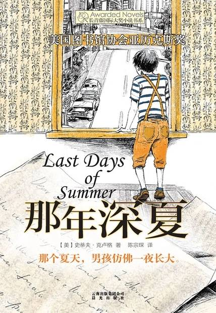

# 《那年深夏》

作者：[美]史蒂夫·克卢格

## 【文摘】

第一种是正统的犹太人，他们脸颊两边留着发辫，一年到头穿黑外套，整天唱那种阴森森的歌，而且教会规定他们不准坐云霄飞车。

白色：云，星星，月亮，浪花。

红色：樱桃最棒，不过樱桃有另外一种含义，要等你年纪大一点再跟你解释，现在还不要用。目前先用红宝石好了。

棕色：栗色的小马。

黄色：有一次我用“蛋黄”来形容海柔，结果两人大吵一架，我被她锁在公寓门外。不过后来她告诉我，女生都无法抗拒金凤花，所以，这是专家的建议，保证万无一失。

紫色：这个比较难。你可以先试试看郁金香之类的花。花这玩意儿我搞不懂，看起来好像都差不多。

绿色：最绿的东西很容易让她气炸，比如青蛙或是巫婆的脸。用草来形容应该还可以，不过前面要加点料，比如“雨后的绿草如茵”。

蓝色：天空和海洋。

黑色：我唯一想得到的就是夜晚和木炭，所以尽量不要去碰黑色，那玩意儿很容易酿下大祸。

橘色：这颜色应该用不到，因为她身上应该没有什么地方是橘色的。万一真的有，叫她赶快去看医生。

## 【想法】

两个“主动”的故事。

长在布鲁克林的犹太人小男孩乔伊·马戈利斯，因父母离婚，从犹太人居多的社区搬到了意大利人居多的社区，他的厄运也来了，经常被意大利小孩殴打，他不愿意告诉妈妈姨妈或者学校真相。他想到的办法是想让当时的棒球明星查理·班克斯给自己“撑腰”，他以谎言从人口统计局获取了查理的住址，然后开始给查理写信，希望他“只要你一上场打击，你是不是可以伸手指向外野，然后说“这一球献给我的好朋友乔伊·马戈利斯”?（记得一定要在电台现场广播的时候。​）接下来，你就只要拿起球棒用力一挥，让球飞到棒球场外。”，当然理由也是谎话连篇，“第一封信你得了霍乱加痢疾，第二封信你得了天花，上上礼拜你得了绝症，上礼拜你眼睛瞎了……哇，你太强了，到现在还没死，还可以去打仗？”。故事要继续写下去，他们肯定成为了朋友。

查理·班克斯也是自己争取机会，然后成为了棒球明星："今年4月初，班克斯参加蓝夹克队的选拔赛，没有入选，没想到他硬是冲上球队的巴士，怎么都不肯下来，结果，蓝夹克队只好让他加入。从那时候起，这位“火爆浪子”年轻的三垒手就成了当地的传奇人物。"

书中以一封封的信件推进故事，一封封剪报告知背景。

写信，或许是很好的交流方式。

寄出去的信，期待对方的回信。对方的来信，可以留存。一来一去之间，也有充足的时间为下一封信创造内容。