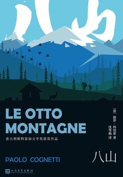

# 《八山》

  作者：保罗·科涅蒂

## 【文摘】

###  序

我的父亲有他自己上山的方式。不太深思熟虑，非常执拗冒失。他爬山从不掂量一下力气，总像在跟什么人或什么东西较劲儿似的，而且若他觉得哪儿的山路太长，就抄近路走极为陡峭的路线。跟他一起爬山时不许停下歇脚，不许因为饿了、累了或冷了而抱怨，但可以唱一支美丽动听的歌曲，尤其在雷雨天或浓雾弥漫的日子里，而且可以一头扎进茫茫雪原中大声吼叫。  

比起爬山，后来她更喜欢坐在草坪上，或者把双脚浸泡在一股溪水中，抑或去辨识山上花草的名字。即使在山顶上，她也更喜欢注视远处的山峰，遥想着少女时代见过的那些山，回想着青春年华曾与谁共度。  

### 第一部分 童年的大山

#### 1

“上来呀！”他从上面探身说道。不过，随后就忘了等我，也许因为他觉得一点儿都不难，或者因为他压根没想到我需要帮助，或者只因为他已习惯如此，不管困难与否，每个人都得自己应付。  

为了平静下来，我在自己的头脑里寻找到一些形象。我想到了山溪，想到水塘、小瀑布，想到了为保持静止不动而摆动尾巴的鳟鱼，想到了被冲刷到别处的树叶和枝杈。然后，又想到跳起来跃向猎物的鳟鱼。我开始明白了一个事实，那就是对于河里的一条鱼来说，所有东西，都来自山，昆虫，树枝，树叶，任何东西。因此，它总是往上看，等待着应该来到的东西。我想，假如你浸入水中的那个点是现在，那么过去就是越过你流去的河水，那朝低处流去的溪水，以及不再有任何属于你的东西的地方，而将来就是从高处流下来的水，带着凶险和惊喜意外。过去是在下游，将来是在上游。这就是我本该回答父亲的话。无论命运是什么东西，它就居住在我们脑袋上方的群山之中。  
#### 2

“我们每个人在山上都有一个自己偏爱的高度，一道与自己相似的风景，在那里会感到自在舒适。”母亲曾这样确信，也许这是真的。她钟情的无疑就是一千五百米高处的树林，云杉和落叶松树林，树荫下生长着橘子、刺柏和杜鹃花，在那里躲藏着狍子。比大山更吸引我的是伴随大山出现的：高山牧场、山涧、泥炭、高山的青草、牧场的牲畜，再往高处，植物就消失了，大雪覆盖了万物，直到夏季开始。一眼望去，是一片灰色的崖岩，带着石英的纹理，镶嵌着黄色的地衣。父亲的天地从那里开始。  

你抬眼望去，可以看到她总是在那里，一个瘦骨嶙峋的女人，戴着一顶黄色小便帽，弓着腰照料洋葱和土豆。她从来不跟人交谈，也没有什么人去找她，直到我母亲去与她攀谈：一个在菜园里，另一个坐在一旁的一根树桩上，从远处看去，似乎她们已经聊了好几个小时了。  

在登山的小路上他对我和布鲁诺说：冰川是对我们所度过的冬天的回忆，它是大山为我们保存的记忆。它在一定的高度上保留着回忆，而倘若我们想了解某一个遥远的冬天，我们就应该往那个高度走。  

“它被称作‘终年不化的积雪’。”他解释道。那是夏天无法融化冬天所落下的全部积雪的地方。有一部分积雪一直坚持到秋天，然后却被冬天又接着落下的大雪所埋没了。那底下就逐渐变成了冰，成了一片不断增厚的冰川，正像树木的年轮；我们数着年轮，就能知道树木的年龄。只是一片冰川并非固定地停留在山顶之上，它在移动，它全部时间里都在往下滑动。  

#### 3

冬天的大山不适合人上去，得让山岭平静。按照他上山下山的哲学，为逃避山下折磨人的烦心事而上山去的哲学，沉重的季节必须跟随在轻松的季节之后，也就是在平原上工作和生活，心情不好的时候，应放在轻松的季节里去排遣。  

### 第二部分 重归于好的家

我在每年不固定的节日里，都以大山作为我的背景：尽管我没再回去过，但当我出门时，总会遥望地平线上的高山，觉得那似乎是一种祝福。  

他说，我丢掉了人生，我回答他说，是他放弃了生活。我们整整一年没有说话，那年我往返于军营当兵，退役后我没跟家里打招呼就走了。这对他更好；对于我来说，也得以走我自己的路，去另一个地方为自己创建一种与他的生活截然不同的生活。就这样，两个人一旦远离开了，就谁也不用再为填补这个距离而作什么努力了。  

#### 6

那是暮春的天气，山里总刮着风。厚厚的云层来来回回地遮掩着太阳，空气还相当寒冷，仿佛冬天执意不想让位去待在一旁。山下面的湖水像是黑色的丝绢，寒风吹起层层涟漪。甚至那都不是波纹，倒像是一只冰冷的手抚平了湖面的波纹，我真想伸开双手放在炉火旁，然后偷取些许热量。  

给我父亲举行了简朴的葬礼之后，对我母亲孑然一身的孤寂生活，以及父亲与人世间那种永恒的冲突，我思索了许久：他死在自己的车子里，没有任何朋友怀念他。在母亲身上，我却看到了她以往漫长的一生结下的果实，她悉心培植人际关系，就像照料她阳台上的花草一样。我寻思着，这样的一种才能人们是否能学到手，抑或生来就是如此。要是我还来得及学得到该多好。  

#### 8

一个留着两撇白胡须的男子对我讲，对于他而言，这是一种重新思考人生的方式，重新攀登同样的一条山路，一年一次，仿佛是沉浸在回忆之中，重新回顾记忆的过程。  

### 第三部分 一位朋友的冬天

#### 9

那位老人捡起一根小棍儿，用它在地上画了一个圈儿。他画得很完美，看得出他是习惯于画草图的。而后，他又在圈里面画了一条直径，然后，画了第二条直径，然后又画了第三、第四条直径，沿着角平分线，这样就得到了带有八条半径的一个轮子。我想到，我得从一个十字架出发，才能走完这样一种图形，不过，从圆圈出发，是典型的亚洲人的做法。

“你见过这样的一幅图吗？​”他问我。

“见过，​”我回答说，​“是曼荼罗。

​”“不错，​”他说，​“我们常说，在世界的中心有一座十分高的山头，须弥山。在它周围有八山八海。这就是我们的世界。​”

他边说边在轮子外面为每条半径画一个小小的尖头，然后，在尖头与尖头之间画一朵浪花。八山和八海。最后在轮子的中心画了一个环，我想，那顶冠可以代表须弥山白雪皑皑的顶峰。他掂量了一下手头的活儿，摇了摇头，仿佛这样的一幅图他已画过上千次了，但最后这次有点失手了。然而，他用小棍子指着中心，下结论说：​“我们是不是可以说：谁游历了八山，或者谁登上了须弥山顶峰，谁就会学到更多的东西呢？​”

我想：世上存在着恋人是美好的，但是大家都在一个房间里面，他们总让你感到自己多余。