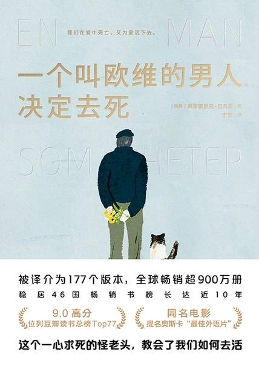

# 《一个叫欧维的男人决定去死》

作者：弗雷德里克·巴克曼

## 【文摘】

失去某人以后总是会有一些奇怪的细节惹人怀念。都是极小的事情。笑容、她睡眠时翻身的样子。为她粉刷房间。  

### 8 一个叫欧维的男人和一对父亲的老脚印

工作带来某种自由。脚踏实地自食其力。  
 
她常说：“每一条道路最终都会带领你到注定的归宿。”对她来说，注定的或许是“某事”。但对他来说，注定的是“某人”。  

### 9 一个叫欧维的男人给暖气通风

说实话，欧维也不知道是从哪天开始的。不是那种让人印象深刻的纠葛，是那种所有小矛盾纠结在一起的纠葛，以至于每句新说出口的话都像踩到了地雷，不重新引爆四个以上老矛盾就根本没法开口。这样的纠葛一而再再而三地蔓延，直到有一天终于耗尽了。  

### 12 一个叫欧维的男人有所获

他从来不知道她为什么选了他。她只爱抽象的东西，音乐、书籍、奇言怪语，诸如此类。欧维却是个满脑子充满具象事物的人。他喜欢螺丝刀和滤油器。他手插口袋疾步人生。她总是在舞蹈。  

每个人的生命中总有那么一刻决定他们将成为什么样的人。要是你不了解那个故事，就不了解那个人。  
  
### 14 一个叫欧维的男人和一个火车上的女人

要是有人问起，他会说，在她之前，他没有生活。之后也没有。  

### 27 一个叫欧维的男人和一场驾车练习

如今车只不过是一种交通工具，而道路只是两点之间乱七八糟的连接线。  

### 33 一个叫欧维的男人和一次非比寻常的巡逻

有时候，人们那些突如其来的行为是很难理解的。有时候，当然，他们会想，反正早晚都要这么做，那么择日不如撞日，就趁现在了。有时候却恰恰相反，人们突然意识到，有些事早就该做了。欧维大概从来就知道自己到底该做什么，但对于时间，所有人都太乐观。我们相信总能腾出时间来与他人一起做想做的事，说想说的话。然后突然有一天，发生了什么意外，我们就只好站在那儿，脑海总盘旋着一个词：如果。  

### 36 一个叫欧维的男人和一杯威士忌

认错很难，特别是错了很久以后。  

### 39 一个叫欧维的男人和死神

死亡是一桩奇怪的事情。人们终其一生都在假装它并不存在，尽管这是生命的最大动机之一。我们其中一些人有足够时间认识死亡，他们得以活得更努力、更执着、更壮烈。有些人却要等到它真正逼近时才意识到它的反义词有多美好。另一些人深受其困扰，在它宣布到来之前就早早地坐进等候室。我们害怕它，但我们更害怕它发生在身边的人身上。对死亡最大的恐惧，在于它与我们擦肩而过，留下我们独自一人。  

时间是一桩奇怪的事情。大多数人只为了未来生活。几天之后，几周之后，或者几年。每个人一生中最恼人的那一刻可能就是突然意识到自己已经到了回忆比展望更多的年龄。当来日无多的时候，必须有别的动力让人活下去。或许是回忆。午后的阳光中牵着某人的手，鲜花绽放的花坛，周日的咖啡馆。或许是孙子孙女。人们为了别人的未来继续生活。索雅离开欧维的时候，他并没有一起死去。他只是不再活着。悲伤是一桩奇怪的事情。  