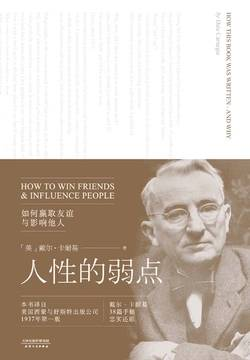

# 《人性的弱点（果麦经典）》

## 【文摘】

### 自序

随着课程的进展，我逐渐意识到成年人不仅需要提高沟通技巧，更需要在日常交往中掌握处理人际关系的能力。

调查结果表明，即使在工程行业等技术为先的行业，个人的成功也只有百分之十五是源自专业能力，另外的百分之八十五则来自“人类工程学”，即人格特质和领导能力。

哈佛大学著名教授威廉·詹姆斯曾经断言：“和人类所具备的潜能相比，我们仍处于蒙昧之中。人类的身心力量只有极小部分得到了发挥。广义而言，人类个体远未到达极限。人类囿于自身习惯，从未将与生俱来的诸多能力发挥至极致。”

普林斯顿大学前校长约翰·希本博士曾经说过：“教育，即为解决生活问题的能力。”

诚如赫伯特·斯宾塞所言：“教育的最大目的并非增进知识，而是增进行动。”

### Chapter01 人际关系的基本技巧

批评是无用的，它激起抵触，让人急于辩白；批评是危险的，它伤害自尊，甚至让人萌生恨意。

和人打交道时，请牢记这一点——人并非理性生物。他们由情感驱使，被偏见支配，傲慢与虚荣是他们的动力之源。

「原则1 不要批评，不要指责，不要抱怨」

「原则2 真心实意地感谢他人、赞美他人」

“如果成功有诀窍的话，”亨利·福特如是说，“这个诀窍就在于洞悉他人的立场，并能够同时兼顾自己和他人的立场。”

请记得：“说服别人的首要途径，是引发对方的强烈欲求。能者纵横四海，庸者踽踽独行。”

「原则3 激发他人的需求」

### Chapter02 赢得他人喜爱的六个方式

#### Section01 广受欢迎的奥秘

著名的维也纳心理学家阿尔弗雷德·阿德勒在他的著作《生活的意义》(WhatLifeShouldMeantoYou)中写道：“漠视同胞之人，生活最为艰辛，给周遭带来的伤害也最为深痛。置身于这样的个体周围，人类命运有如堕入寒冬，生机难复”。

「原则1 建立对他人的兴趣，真心诚意地关注他人」

#### Section02 如何建立美好的第一印象

世人都在寻找幸福，幸福之路也的确存在。学会控制自己的想法，就能够得到幸福。幸福并非取决于外在条件，而是取决于心理状态。

「原则2 微笑」

#### Section03 记住他的名字

「原则3 无论对于何人，无论以何种语言，自己的名字都是世界上最甜蜜最重要的词汇」

#### Section04 你想变得健谈吗

专注的倾听是我们能够给予他人的最高赞许。

杰克·伍德福德曾在《爱上陌生人》(StrangersinLove)一书中写道，“关注是最含蓄的谄谀。极少有人对他人一心一意的关注无动于衷”。

「原则4 专注地倾听，鼓励他人谈论自己」

#### Section05 如何引起他人的兴趣

谈论对方最在乎的事情，是直抵对方内心深处的捷径。

「原则5 谈论对方感兴趣的事情」

#### Section06 让每个人都喜欢你

约翰·杜威称，人性中最深层的动力是“对重视的渴求”；威廉·詹姆斯断言，“人性的根源深处，强烈渴求着他人的欣赏”

「原则6 真心实意地让对方知道他有多重要」

### Chapter03 如何让他人想你之所想

#### Section01 争论永无赢家

「原则1 赢得争论的方法只有一个，那就是避免争论」

#### Section02 如何避免树

「原则2 尊重他人的观点，绝不要说“你错了”」

#### Section03 坦率承认错误

「原则3 如果你错了，请坚决果断地承认错误」

#### Section04 一滴蜜糖

「原则4 沟通始于友善」

#### Section05 苏格拉底的秘密

与人商谈时，请先强调你赞同的观点，不要急于挑明分歧。如果可能的话，请让对方了解，你们的差异在于方法而非目的。

想要反驳对方的时候，请记得苏格拉底的谋略，温和地抛出问题——一个答案为“是”的问题。

「原则5 让对方点头称“是”」

#### Section06 对待抱怨的安全方式

「原则6 让对方主导谈话」

#### Section07 如何取得合作

拉尔夫·瓦尔多·爱默生在《论自助》(Self-Reliance)一文中写道：“在每一部伟大作品中，我们都会发现被自己摒弃的思想；它们带着某种疏远的威严，重新回到我们面前。”

「原则7 循循善诱，让对方自行得出结论」

#### Section08 创造奇迹的妙方

杰拉德·尼伦伯格在《进入人们的内心世界》(GettingThroughtoPeople)一书中评论道：“若想让交流变得顺畅，请像重视自己的感受一样重视对方。请在商谈之初就表明议题，并在开口之前先斟酌一下，如果你是对方，你愿不愿意听这些话。如果你希望对方认可你的观点，请先接受他的观点。”

「原则8 抛开成见，将心比心」

#### Section09体谅他人

亚瑟·盖茨博士在其著作《教育心理学》(EducationalPsychology)一书中说道：“人类普遍渴求同情。孩童给别人看伤口，甚至故意把自己弄伤，借此博取同情……成人同样如此。他们展示创伤，讲述所经历的事故、病痛或是手术细节。无论这些不幸是现实还是假想，‘自怜’都普遍存在于人类行为之中。”

「原则9 体谅他人的想法和愿望」

#### Section10 没人会拒绝这样的请求

人们当然知道自己真正的动机，不需要你帮他们指出来。但是每个人的内心都会把自己高尚化，因而也需要一个听起来更高尚的动机。如果你想改变他人，请帮他们想出这个更高尚的理由。

「原则10 激发对方内心深处的高尚情操」

#### Section11 电影电视都是这样做的

「原则11 戏剧化你的想法」

#### Section12 任何方法都不奏效的时候，请使用杀手锏

「原则12 激将法」

### Chapter04 如何改变他人，成为领导者

#### Section01 挑错的时候，请用这种方式

「原则1 欲抑先扬」

#### Section02 怎样批评不会触犯众怒

「原则2 间接地引起对方的注意」

「原则3 批评对方之前，先谈谈你自己的过错」

#### Section04 没有人喜欢听命于人

「原则4 以引导代替命令」

#### Section05 给对方留足面子

「原则5 给对方留足面子」

#### Section06 如何激励他人走向成功

人人都喜欢被称赞，但只有具体化的称赞才能够使人信服，不会被对方当作安慰话一笑置之。

「原则6 夸奖他人每一点微小的进步，“由衷地赞许，不吝啬赞美之词”」

#### Section07 用美誉激励他人

「原则7 用美誉激励他人，他就会努力不辜负你的期望」

#### Section08 鼓励对方勇于改变

「原则8 鼓励对方勇于改变，让改正错误听起来轻而易举」

#### Section09 让对方乐于为你做事

如果想改变对方的态度或行为，领导者须将下述建议谨记在心：1.实事求是。做不到的事情请不要承诺。忘记自己的私利，关注对方的利益；2.目的明确。清楚知道你希望对方做什么；3.有同理心。扪心自问什么是对方真正的需求；4.换位思考。想一想对方帮你做事能得到哪些好处；5.利益交换。找到上述好处与对方需求的结合点；6.表明态度。提出请求的时候，向对方说明他如何能从中受益。

「原则9 让对方乐于为你做事」

### Chapter06 幸福家庭生活的七个法则

#### Section01 这样做无异于自掘婚姻坟墓

「原则1 别唠叨了」

#### Section02 别用爱绑架对方

“婚姻的第一课，是学会尊重对方独有的生活之道。”

利兰·福斯特·伍德在其著作《在家庭中共同成长》(GrowingTogetherintheFamily)中同样说道：“婚姻的真谛不仅在于找到合适的对象，更在于当一个称职的对象。”

如果你希望婚姻美满，请：「原则2 不要试图改变对方」

#### Section03 请勿相互指责

「原则3 请勿责难」

#### Section04 学会欣赏

「原则4 真心诚意地欣赏对方」

#### Section05 女人眼中重要的事

女人极为看重生日和纪念日。为什么？对男性来说，这永远是关于女性的不解谜题之一。男人普遍在这一点上稀里糊涂，但是有四个日期是无论如何都不能忘记的——哥伦布发现美洲大陆的日子、美国独立日、妻子的生日和结婚年月日。如果你记不住，忘记前两个日子也没关系，但是千万别忘记后两个！

长远来看，婚姻就由琐碎之事构筑而成，漠视这一事实的人们只能自求多福了。埃德娜·圣文森特·米莱曾用睿智的诗句总结道：“令人心碎的不是爱情的消逝，而是它消逝时我们竟懵懂不知。”

「原则5 细微之处见真情」

#### Section06 不要忽视这一点

粗鲁无疑是葬送爱情的毒药。人人对此都心知肚明，但我们对陌生人比对亲人要客气得多。我们绝不会打断陌生人的话，抱怨说：“老天爷，这个故事你要讲多少遍！”我们也不会未经允许就拆开朋友的信或是窥探他的隐私。只有对我们的家人，我们最亲近的人，我们才会为了一点小小的过失大加嘲讽。

婚姻美满的凡人比孓然一身的天才更加幸福。

「原则6 谦和有礼」

#### Section07 不要做“婚盲”

巴特菲尔德博士说：“婚姻生活的满足程度受若干因素影响，性是其中一个因素，也是其他因素的前提。”那么如何满足这一因素呢？巴特菲尔德博士说：“请学会用客观的讨论代替尴尬的沉默，以超然的态度在婚姻中不断实践。一本可靠且格调高尚的书能令你更快地掌握这一能力。除了我自己的著作《婚姻与性生活和谐》(MarriageandSexualHarmony)之外，我还想推荐几本书。“在市面上的这类书籍中，下述三本书较为适合大众阅读：伊莎贝尔·E.赫顿的《婚姻性爱技巧》(TheSexTechniqueinMarriage)、麦克斯·埃克斯纳的《婚姻中的性》(TheSexualSideofMarriage)，以及海伦娜·莱特的《婚姻中的性因素》(TheSexFactorinMarriage)。”

下述书籍将教给你如何科学而坦诚地对待婚姻中的性事。
1.《生活中的性》(TheSexSideofLife)玛丽·韦尔·丹尼特著一本适合年轻人阅读的书籍。由作者在纽约州长岛市29街24-30出版。
2.《婚姻性事》(TheSexualSideofMarriage)M.J.埃克斯纳博士著这本著作为婚姻中的性问题提供了可靠而适度的解读。诺顿出版公司纽约市第五大道70号
3.《婚前准备》(PreparationforMarriage)肯尼斯·沃克著这本书明晰地阐述了婚姻问题。诺顿出版公司纽约市第五大道70号
4.《婚后的爱情》(MarriedLove)玛莉·C.斯洛普斯著对两性关系开诚布公的探讨。普特曼森斯出版公司纽约市西45街2号
5.《婚姻中的性事》(SexinMarriage)欧内斯特·R.格罗夫与格拉迪斯·H.格罗夫著内容翔实全面。艾默生出版公司纽约市西19街251号
6.《婚前准备》(PreparationforMarriage)欧内斯特·R.格罗夫著艾默生出版公司纽约市西19街251号
7.《已婚女性》(TheMarriedWoman)罗伯特·A.罗斯博士与格拉迪斯·H.格罗夫著幸福婚姻的实用指南。全球出版集团旗下托尔图书纽约市西49街14号

「原则7 读一本解析婚姻中性事的好书」

## 【想法】

根据封面可知英文书名是《HOW TO WIN FRIENDS & INFLUENCE PEOPLE》，也有小字翻译《如何赢得友谊和影响他人》，但是最显眼的翻译是《人性的弱点》，虽然作者在文中多次强调“请让我再次重申：本书所述的原则只有发自内心才会行之有效。我并不提倡钻营取巧。我所倡导的，是一种全新的生活态度。”书中的例子，尤其是商业方面，投其所好，说是钻营取巧也不为过，或许这个直白的翻译更确切。