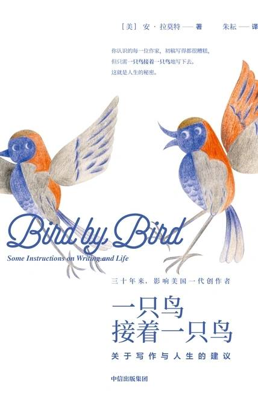

# 《一只鸟接着一只鸟：关于写作与人生的建议》

作者：安·拉莫特

## 【文摘 & 笔记】

### 前言

◆ 当作家的好处之一，便是工作给了你去做任何事的理由，去任何地方挖掘、探索的理由。另一个好处是，写作促使你更贴近生活，观察生活中沉重、低迷的时刻。

◆ 希望是一种义无反顾的耐心

### 01 开始动笔就对了

◆ 弗兰纳里·奥康纳曾说，任何有本事撑过童年的人，一辈子都不缺题材可写。

◆ 因为对我们当中的某些人来说，书籍跟世上的一切事物同等重要。这些小小的、扁平的、坚硬的方形纸制品，竟能在我们眼前展开一个又一个天地，陪伴、抚慰、平静、激励我们的心，实在不可思议。书能帮助我们了解自己是谁、为何如此行事，让我们看到群体和友谊的意义，告诉我们如何生活和死亡。书中充满了我们无法立刻从现实生活中获得的一切，例如美妙、充满情感的语汇。此外，书还赋予了我们长时间的专注力：我们可能会在日常生活中留意到一些令人惊奇的小事物，却很少停下来仔细观察，而某位作者竟能写出使我们专心沉浸其中的迷人作品，这是一种伟大的天赋。我对好书的感激之情是无穷尽的，我对它们怀抱着与大海等量齐观的感激。

### 02 先写一段一英寸见方的短文

◆ 第一条有用的写作建议是撰写短文。

◆ E.L.多克托罗曾说：“写小说就像开夜车。你的视线只局限于车头灯照得到的范围，但你还是能开完整段路。”你不需要明白自己将前往何处，也不用看见目的地或途经的一切，你只要能看清前方的一两百米即可。这是目前为止我听过的关于写作或人生最好的建议。

### 03 所有的杰作都始于拙劣的初稿

◆ 我几乎可以断言，比练习写短文更好的一个建议，是知道“初稿通常很烂”。

### 04 完美主义

◆ 完美主义是压制者的代言人，是公敌。它会逼疯你、束缚你一辈子，也是你完成拙劣初稿的主要障碍。

◆ 你每天持续努力，或许得到的是一堆漫无章法的文字，但就算如此也无妨。冯内古特曾说：“当我写作时，感觉自己就像个无手无脚的人，嘴里咬着一支蜡笔。”所以不妨放手去写，即使写出来的东西零散杂乱、不乏严重错误，把纸张全都浪费了。完美主义是一种僵化、刻薄的理想主义，而杂乱是创作者真正的朋友。人们多少会遗忘（我相信是无意的）的一条童年经验，就是我们需要靠制造脏乱来发现自己是谁、为何存在——还有，更进一步来说，发现我们该写什么。

### 07 角色

◆ 一行精准呈现角色性格的对话，远胜好几页平铺直叙

◆ 塑造讨喜的叙述者，是让作品引人入胜的关键！

◆ 我曾询问伊桑·卡宁，据他所知，最有价值的写作建议是什么？他毫不犹豫地说：“没有什么比一个能赢得人心的叙述者更重要。没有什么比这更能将整个故事凝聚在一起。”

◆ 不见得每个人都那么风趣或聪慧，但如果他们拥有敏锐的洞察力，仍可以成为一个很棒的朋友或叙述者——尤其是当他们愿意为生存奋斗，或正在经历如此过程的时候。

◆ 艰险和尊严能让叙述者变得吸引人。

◆ 和所有角色共处数个月后，你才会知道真正的主角是谁
### 08 情节

◆ 情节指的是书或文章的主线。若想阅读针对情节构造的长篇精彩论述，你可以选择E.M.福斯特和约翰·加德纳的书籍。他们精辟透彻、充满智慧的论点，会令你拍案叫绝。

◆ 先了解角色再发展情节，千万不要让情节绑架角色

◆ 好的情节必须像梦境一样，栩栩如生、没有中断

◆ 约翰·加德纳写道：“作者创造出一个梦境并邀请读者进入其中，而梦境必须栩栩如生、没有中断。”

◆ 戏剧性是抓住读者注意力的一种方法。戏剧的基本结构是开篇设定、发展、高潮——和讲笑话一样。

◆ 爱丽斯·亚当斯 说，有时她会运用一套公式来写短篇小说，这套公式简称“ABCDE”，即行动(Action)、背景(Background)、发展(Development)、高潮(Climax)、结尾(Ending)。

### 09 对话

◆ 对话不是要重现一段真实的发言，而是转译角色讲话时注入字句的语调和节奏。你要将你对角色说话方式的理解写出来。

◆ 故事角色的言语应该或必须比真人开口说出来的话更有趣、更扼要，甚至更真实。

◆ 写出引人入胜对话的三个诀窍

- 首先，听听你写下来的对话，也就是将之大声念出来。如果你无法做到，默念也无妨。你必须不断练习，一次又一次地反复去做这件事。然后在你外出、离开你的书桌时，去听听别人聊天，你将会发现自己开始剪辑这些对话，变换它们，在脑中想象若将它们写在纸上看起来会如何。不妨听听别人实际上如何说话，然后慢慢学习将他们五分钟的言谈浓缩成一个句子，同时依然保留原意原味。若你是写作者，或想成为一个写作者，这正是你度过每一天的方式——聆听、观察、将收获储存起来，让自己的置身事外有所回报。将你吸收到的、偷听到的一切带回家，然后将它们化为宝物（或至少尝试这么做）。

- 其次，别忘了你必须能够透过每个角色的言谈，辨认出他或她是谁。一个角色的说话方式和特色应该跟其他角色不同。他们不能全都像你自己，每个角色都必须拥有自我。若你能赋予各个角色与之相符的说话方式和特色，便能由此得知他们的衣着、所开的车，也许还有他们在想什么、父母教养他们的方式，以及他们内心的感受。你必须任由自己去聆听他们正在说什么，而不只是你自己在说什么。至少给每个角色一个表达的机会，有时他们正在说的话和他们说话的方式，会让你最后发现他们其实是什么样的人，以及实际上正在发生的事。

- 第三，你或许可以把两个互相看不顺眼的人放在一起，这两个人彼此厌恶到宁可整天被关在家里，也不愿冒着可能会碰到对方的危险出门。这世上的确有一些人几乎让我想加入政府的证人保护计划，以确保我绝不会再跟他们有所接触。或许你的生活中也有这类人存在。不妨挑出一个角色，你的故事主角正好对他或她有这种强烈厌恶的感觉，将这两人放在同一部电梯里再让电梯出故障停运。没有什么比超级紧绷的气氛更一触即发了。现在他们两人都有很多话想说，但又怕自己无法控制想说出口的话。他们担心自己会突然爆发，他们可能会也可能不会，总有一种方法可以得知。无论如何，精彩的对话能给予我们偷听的感觉，而作者不会出面阻止。精彩的对话既包含了说出口的话，也包含没说出口的话。没说出口的话会耐心地坐在那部卡住的电梯门外等待，或者在电梯内如老鼠般绕着那两个人的脚跑。所以，不妨让这两个人克制自己的一些念头，同时让他们引爆些小炸弹。

### 14 以宽容之心观察万物

◆ 全神专注于自我以外的某样事物，是理性的强力解药

### 16 相信你的直觉，聆听你的花椰菜

◆ 写作是一种自我催眠的过程：你相信自己，写出故事，然后清醒过来，客观审视成品。

### 18 嫉妒

◆ “有时我会自怜，但我始终在乘着大风飞越天际。”

◆ “我起床。我行走。我跌倒。同时，我一直在跳舞。”

### 19 随时笔记索引卡

◆ 索引卡能带你脱离灵感枯竭，挤出一个又一个该死的字

### 24 创作瓶颈不是障碍

◆ 生命就像资源回收场，人类的一切喜怒哀乐和关心顾虑都在世间反复循环、再现，你必须发挥感受力，比如拿出独特的幽默感、将心比心的同情或理解。

### 25 为你的挚爱写一份献礼

◆ 为心爱的人留下一份纪录，并帮助正在经历困境的人

◆ 托妮·莫里森说：“自由的作用在于解放他人。”若你已不再被某人或某种生活方式困扰束缚，不妨说出你的经历，大胆解放他人。

### 28 出书的迷思

◆ 写作最好的回报就是写作本身，“全心投入”才是意义所在

◆ “这个世界无法给予我们安宁，”他说，“也无法给予我们平静。我们只能在自己的内心找到它。”
◆ “我恨这点。”我说。“我了解，但好消息是，因为只存在于内心，这世界同样无法夺走它。”