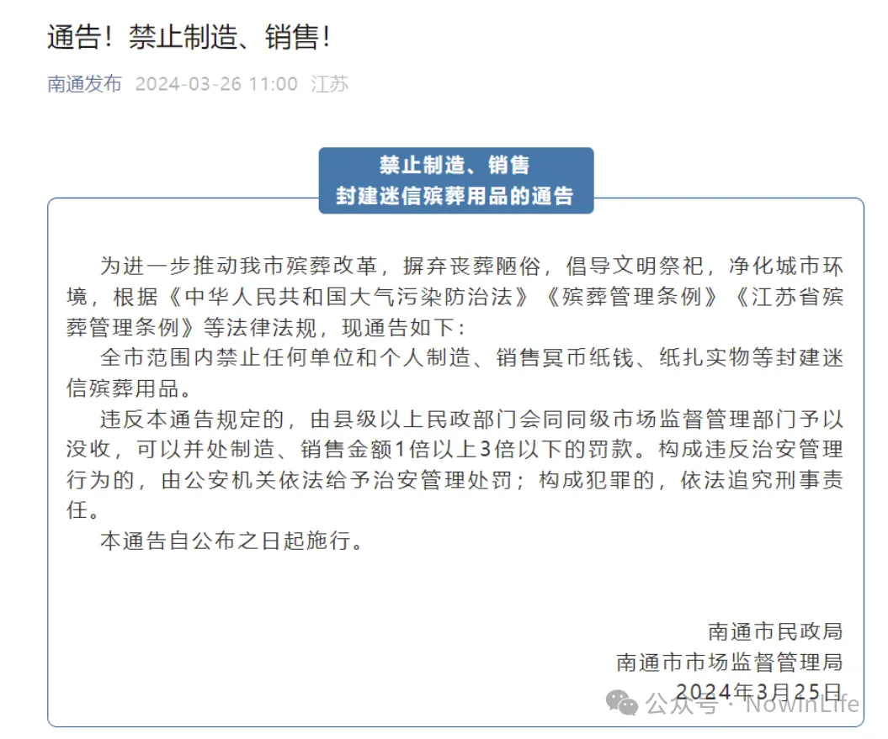
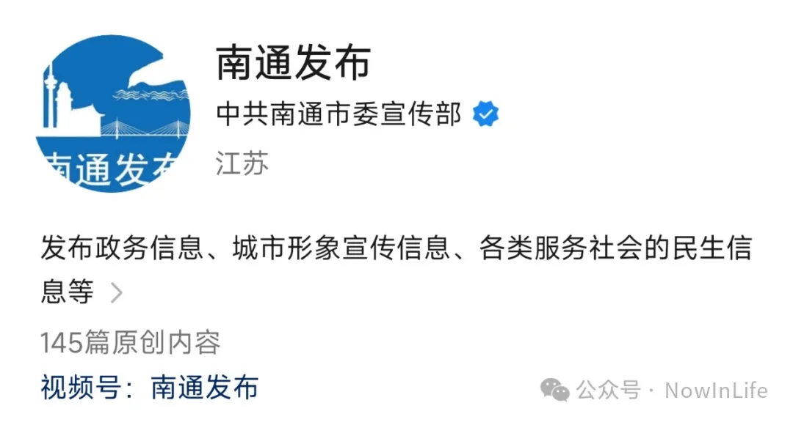

# 清明祭祖

> 清明节又称踏青节、行清节、三月节、祭祖节等，**是中华民族传统的重大春祭节日，属于慎终追远、礼敬祖先、弘扬孝道的一种文化传统节日**。清明节既是一个扫墓祭祖的肃穆日子，也是人们亲近自然、踏青游玩、享受春天乐趣的节日。清明节在传承发展中杂糅了多地多种民俗为一体，具有极为丰富的文化内涵。
> 
> 《百度百科》

（一）  

由《南通发布》的这篇上了热搜的通告说起。

  

首先要吐槽的就是标题《通告！禁止制造、销售》，完全不知所云，这是一条合格的通告标题吗？作为政府的权威媒体，却小丑一般，这种水准的标题也吸引不了人吧？网络媒体乱象治理，有必要从政府的网络媒体开始。

文化自信，自十八大以来一直在提：

“坚定文化自信，秉持开放包容，坚持守正创新”

“坚定中国特色社会主义道路自信、理论自信、制度自信，说到底是要坚定文化自信，文化自信是更基本、更深沉、更持久的力量。”

“文化自信是一个国家、一个民族发展中最基本、最深沉、最持久的力量。”

那么，文化自信来自何处？不就是所谓的传统文化吗？春节、清明节、端午节、中秋节定为国家法定节假日，不就是为了更好地传承传统文化吗？如果把传统习俗简单地定义为陋俗、糟粕。那么这些传统文化不就徒有其表了吗？至于说什么污染环境，相对于工业社会持续的环境污染破坏，那不是不可以妥协的事。

（二）

数千年来，中国的百姓大都生活贫苦，生前穷了苦了一辈子，自然希望死后万一有阴间的话，能够得到阳间亲人的接济，这是对将死之人的安慰。亲人去世，活着的人也不希望死去的亲人无依靠，祭奠亲人，这是对生者的安慰。传统的丧葬、祭奠，烧纸钱冥币、纸货等，自有其道理。

当然，不提倡过分地铺张浪费，在易燃的地方焚烧等。

(三)

祭祖，应该是件肃穆的事。

如果没有时间回老家祭祖，请人打扫、修葺坟墓，也无可厚非。但是请人“祭祖”，那就过于儿戏了。

【公众号】

[清明祭祖](https://mp.weixin.qq.com/s/Kzzx_eAMyVBuhqXJ-4V-NA)