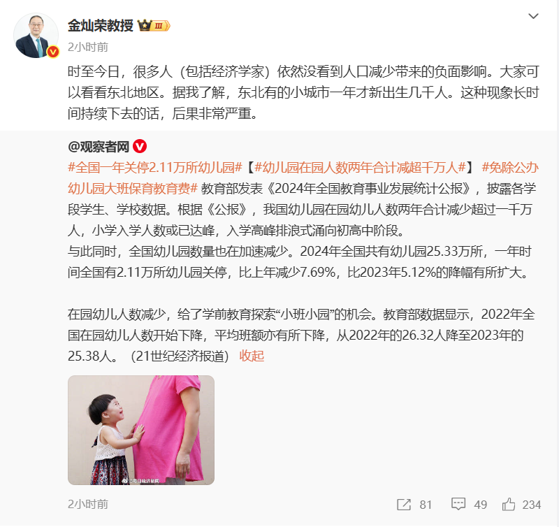
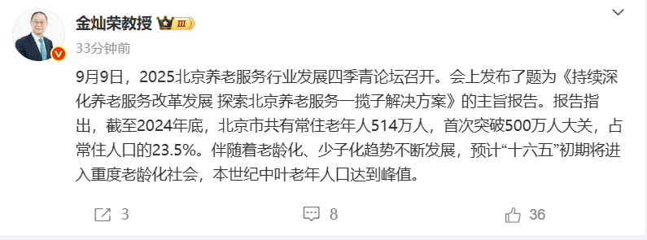

# 谈人口问题

## 出生率降低

>从2025年1月1日起，对符合法律法规规定生育的3周岁以下婴幼儿发放补贴至其年满3周岁。

或许从实行计划生育政策开始就注定会发生的事，独生子女长大的人，生育二胎乃至三胎的意愿能有多强？对不少人来说，生育一个孩子就能交代了。加之网络媒体上一些不生育观点的影响，选择不生育的人大概率也是增加的。俗话说“由俭入奢易，由奢入俭难”，已形成的观念要改变是很困难的。

一个城市、区域的经济问题不能指望人口来解决，劳动力向有产业有工作岗位的地方迁移是必然的趋势，没有产业没有工作岗位，留不住人生再多又有什么用？

时不时看到一些公司采用智能化节省了多少人力的报道，这当作科技发展的一面来报道，但另一面页也说明了对劳动力资源需求的减少。试想在可预见的未来，有那种产业能够提供大量的工作岗位？

或许在新的财富分配方案出台前，只要不出现断崖式下跌，人口逐渐减少是有利的。

为了应对出生率降低的状况，网上各色专家出尽馊主意。不过国家目前出台的政策是发放婴幼儿抚养补贴。

## 人口老龄化

>丹麦继日本之后，成为全世界第二个国家，将退休年龄提高到70岁。

>从2025年1月1日起，中国将实施渐进式延迟退休政策。这一政策旨在应对人口老龄化，鼓励劳动者延长工作年限，保障劳动者权益。

人口老龄化意味着更长的人均寿命，

https://weibo.com/2810373291/Q4enk6yzl

[全国人民代表大会常务委员会关于实施渐进式延迟法定退休年龄的决定__中国政府网](https://www.gov.cn/yaowen/liebiao/202409/content_6974294.htm)
