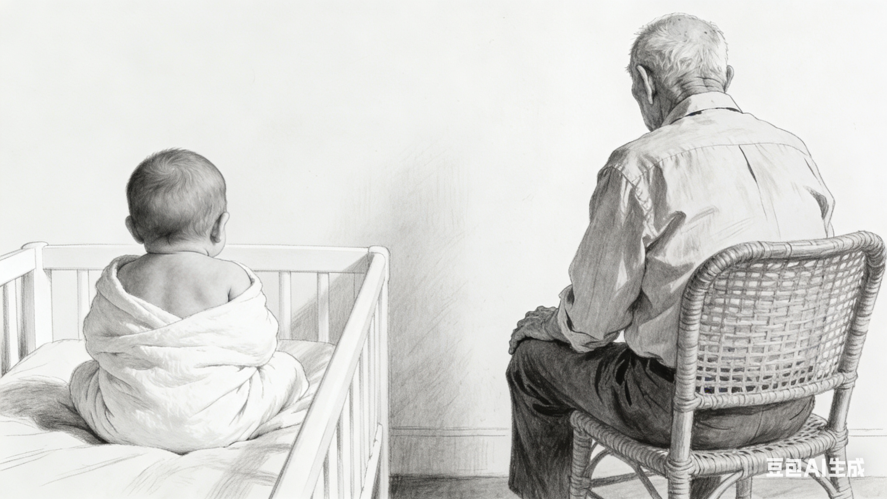

# 谈人口问题

## 出生率降低

>从2025年1月1日起，对符合法律法规规定生育的3周岁以下婴幼儿发放补贴至其年满3周岁。

或许从实行计划生育政策开始就注定会发生的事，独生子女长大的人，生育二胎乃至三胎的意愿能有多强？对不少人来说，生育一个孩子就能交代了。加之网络媒体上一些不生育观点的影响，选择不生育的人大概率也是增加的。俗话说“由俭入奢易，由奢入俭难”，已形成的观念要改变是很困难的。

一个城市、区域的经济问题不能指望人口来解决，劳动力向有产业有工作岗位的地方迁移是必然的趋势，没有产业没有工作岗位，留不住人生再多又有什么用？

时不时看到一些公司采用智能化节省了多少人力的报道，这当作科技发展的一面来报道，但另一面也说明了对劳动力资源需求的减少。试想在可预见的未来，有那种产业能够提供大量的工作岗位？

或许只要不出现断崖式下跌，人口逐渐减少是有利的。

为了应对出生率降低的状况，网上各色专家出尽馊主意。不过国家目前出台的政策是发放婴幼儿抚养补贴。

## 人口老龄化

>丹麦继日本之后，成为全世界第二个国家，将退休年龄提高到70岁。

>从2025年1月1日起，中国将实施渐进式延迟退休政策。这一政策旨在应对人口老龄化，鼓励劳动者延长工作年限，保障劳动者权益。

“35岁危机”的说法在互联网常常被提及，但是即便遇到了职业瓶颈，好歹有份工作；即便失业了，也有机会找到新的工作。可60岁以后呢，一旦遇到了财务危机，想要份工作，但是有多大几率找到工作呢？

延迟退休，减缓几年领取养老金，多几年赚取工资，初步的应对措施吧。另一方面，也可以说减少了年轻人的工作岗位，就这点而言出生率降低有助于应对人口老龄化。

最近几年来，银行的存款利率降得很低了，存款能获取的利息很少，在银行或其他机构买一些所谓的“稳健”理财产品，一段时间有一些收益，可一不留神，一段时间又是不断的亏损，实际的收益可能还不如存款。时不时收到各家银行诸如此类的短信：“助力经济恢复或者政策放宽，我行提供xx额度的贷款，随借随还”，想法设法让你花钱。那么退休后，个人能为养老存储多少资金？

在一个少子、无子的老龄人口群体不断增多的社会，养老更多的要依赖国家养老政策和服务，养老金池子够大吗？医疗服务够用吗？对于养老金比较低的人，要如何保障他们的生活？

未来的几十年，养老，对个人或者国家，或许都是一个很大的挑战。感觉更甚于人口出生率降低带来的影响。

https://weibo.com/2810373291/Q4enk6yzl

[全国人民代表大会常务委员会关于实施渐进式延迟法定退休年龄的决定__中国政府网](https://www.gov.cn/yaowen/liebiao/202409/content_6974294.htm)

https://mp.weixin.qq.com/s/K2qGNRMAwFqW2ts-rxmuXA