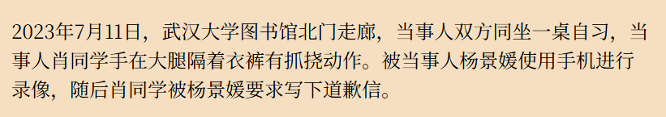
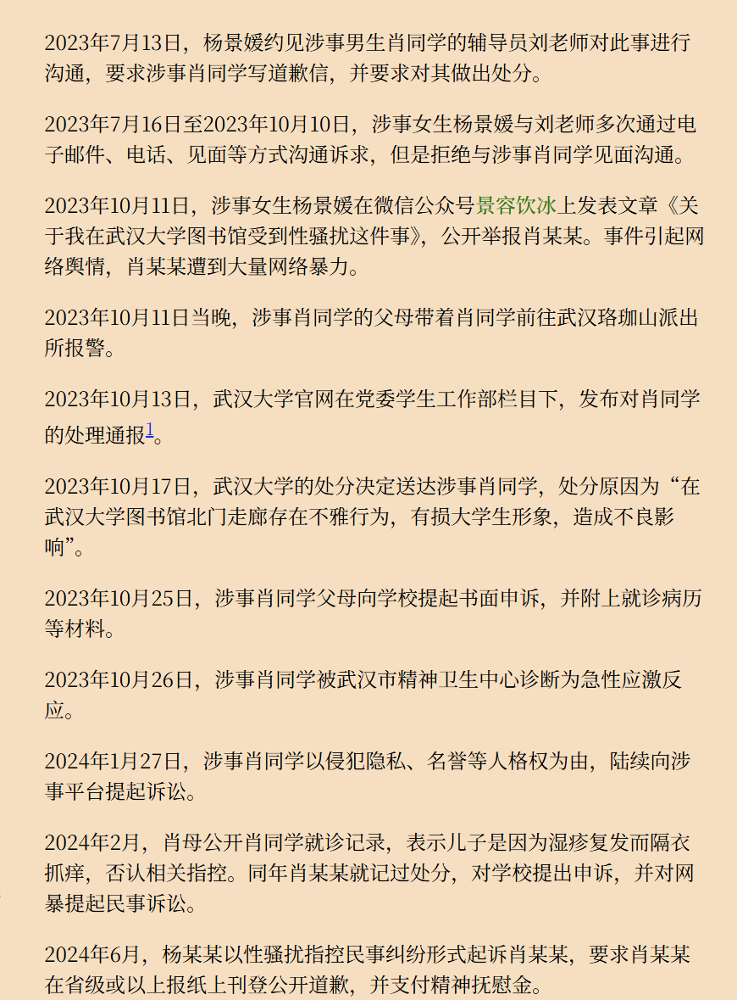
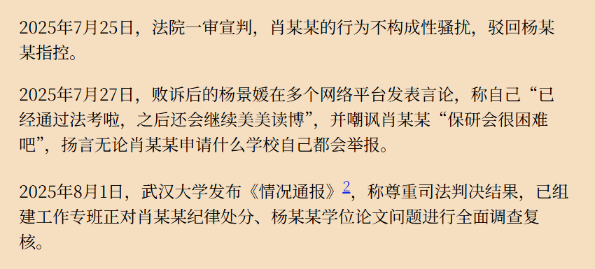
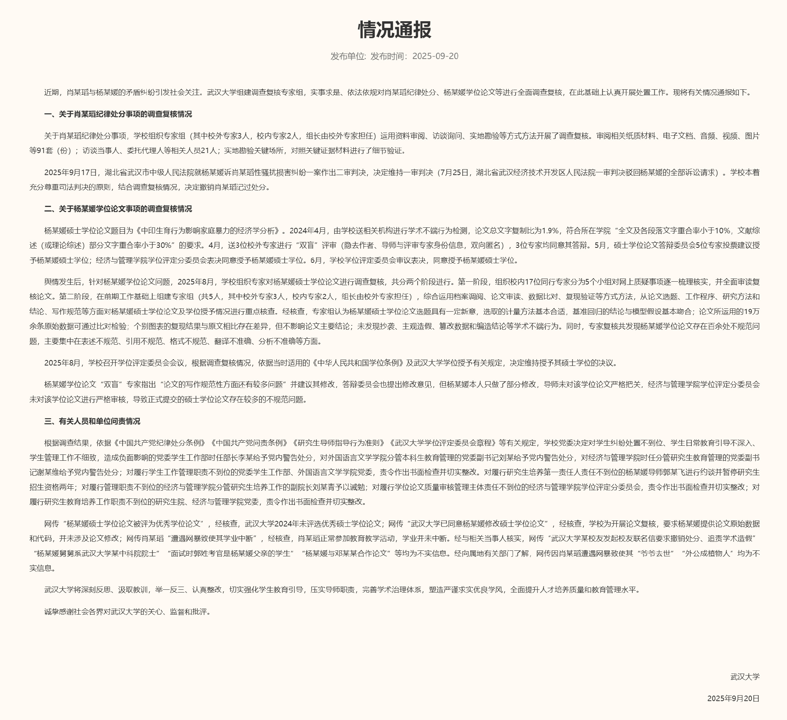
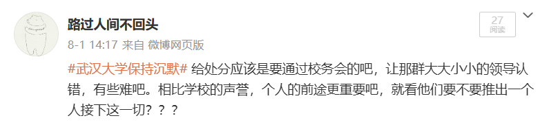

# 评“武汉大学图书馆诬告性骚扰案及后续”

在7月25日法院一审宣判后，武汉大学并未取消对肖某某的处分决定，武汉大学又陷入舆论漩涡，之后杨某某的硕士毕业论文《中印生育行为影响家庭暴力的经济学分析》诸多错误被网友挑出来，又扩大到对其导师等人的论文挑错、曝光。

7月31日，武汉大学校长张平文回应称，学校正在处理中，要等上级的安排才会公布处理结果。

很长的一段等待期。

9月19日，武汉大学更换党委书记。

9月20日，武汉大学发布通报，撤销肖某瑫记过处分。

曾看到有人讨论”武汉大学为何要赌上百年校誉，去保护杨某某?“，没看具体内容，我在微博上写了自己的想法：”给处分应该是要通过校务会的吧，让那群大大小小的领导认错，有些难吧。相比学校的声誉，个人的前途更重要吧，就看他们要不要推出一个人接下这一切？？？ ​​​“

评论：

1. 事件发生后，对杨某某的诉求，校方（这个阶段应该是肖某某的辅导员刘老师，不知他有没有向相关的领导汇报）没有通过报警等手段对事件定性，基本就是拖。
2. 杨某某在公众号发表文章公开举报，引起舆情。肖某某的母亲已报警，不知道警方当时有没有做出判断，也不知道武汉大学有没有和警方沟通，结果是为了平息舆情，给了肖某某处分。
3. 在一审宣判后，武汉大学没有积极跟进，又是一轮舆情，甚至影响到学校的学术声誉。
4. 最后的结果也可以折射出一些事情，在中国的政治生态中，在学校等的系统中，领导的意志占有绝对的主导权，如果没有大领导的主导，内部的纠错能力很弱，在这种情况下，需要外部力量的介入。

[武汉大学图书馆杨景媛诬告肖同学事件](https://yangjingyuan1999.github.io/)

[情况通报-武汉大学](https://www.whu.edu.cn/info/5231/258444.htm)
