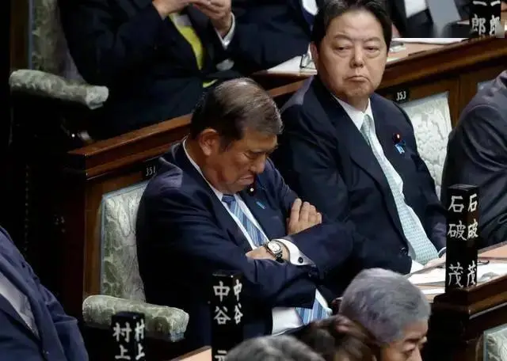

>1989年柏林墙的倒塌似乎标志着弗朗西斯·福山(Francis Fukuyama)所言的“历史的终结”，意思是几个世纪以来关于各国最佳政治与经济模式的争论宣告结束。不久之后，苏联的解体再次确认了美国身为世界上唯一无可争议的超级大国角色。此后近30年里，世界经历了极其罕见的事情：没有大国竞争。这导致世界上许多地方采用了美国的政策偏好——自由市场经济与贸易、民主政治和开放的技术平台。这些发展助长了巨大的全球增长，致使各国为了追求经济繁荣而不再优先考虑其国家政治利益，这种现象被托马斯·弗里德曼(Thomas Friedman)称为“黄金紧身衣(golden straitjacket)”。
>—— 《哈佛商业评论》中国（2023年第4期）

新加坡外交家、学者马凯硕在一次访谈中说到：弗朗西斯·福山《历史的终结》一文对西方造成了深远的智力创伤（Francis Fukuyama's essay The End of History did a lot of brain damage to the west）。

1989年福山在《国家利益》夏季号上发表题目为《历史的终结》的文章，他在那篇文章中指出，自由民主政体作为一种政府体制来说，它的合法性在过去时间里已经得到了高度的认可，因为它战胜了像世袭君主制、法西斯主义和晚近的共产主义这些与之竞争的意识形态。他断言，自由民主政体可能构成“人类意识形态进化的终点”和“人类政府的最终形式”，并由此构成“历史的终结”。

作为冷战的胜利者，必然会以胜利者的姿态来讲故事，福山的理论恰逢其会。

美国领头向世界推广“民主”，效果如何呢？“阿拉伯之春”终成“阿拉伯之冬”，数百万难民涌向欧洲，穆斯林“入侵”基督世界，中东的乱局现在还在持续。

“民主政治”的巅峰期或许在过去的历史中了。美国主要是两个政党竞争，更多的国家则是很多个政党竞争、联合执政，这种两党乃至多党竞争的政治生态，演化到现在，越来越难达成共识，为了获得选票，人为制造分化，族裔肤色、宗教、LGBTQ等等都成为了政治话题。

2021年1月6日，时任总统唐纳德·特朗普的支持者因质疑2020年总统选举结果合法性，强行闯入国会大厦，中断国会联席会议对拜登当选的认证程序。

美国联邦政府 2025 年因参议院连续 13 次否决众议院通过的临时拨款法案发生停摆，持续至 11 月5 日达 36 天，成为持续时间最长的政府停摆事件。政府停摆（Government Shutdown）指美国因国会未通过预算法案或持续性决议案，导致美国联邦政府停止非必要服务的情况。

”灯塔国“都搞成这样，更何况其他国家？

英国、法国、德国等欧洲国家，有哪个比美国做得更好？

韩国换一任总统，差不多就要把上一任总统送进监狱。

日本的首相换的有多勤快，看过新闻多少有一些了解。即便从首相职位离任了，但在党派内，仍然位居高位，影响着政局。不仅仅只有日本是这样。

”求同存异“在政治竞争中只会变得越来越难，如果在野党积极支持当政党，一旦当政党把存在的问题解决了，那岂不在野党永远都是在野党了？

当下有哪个国家堪称“民主”典范？

[政府停摆_百度百科](https://baike.baidu.com/item/%E6%94%BF%E5%BA%9C%E5%81%9C%E6%91%86/15711020)

[历史的终结及最后之人_百度百科](https://baike.baidu.com/item/%E5%8E%86%E5%8F%B2%E7%9A%84%E7%BB%88%E7%BB%93%E5%8F%8A%E6%9C%80%E5%90%8E%E4%B9%8B%E4%BA%BA/12637654)